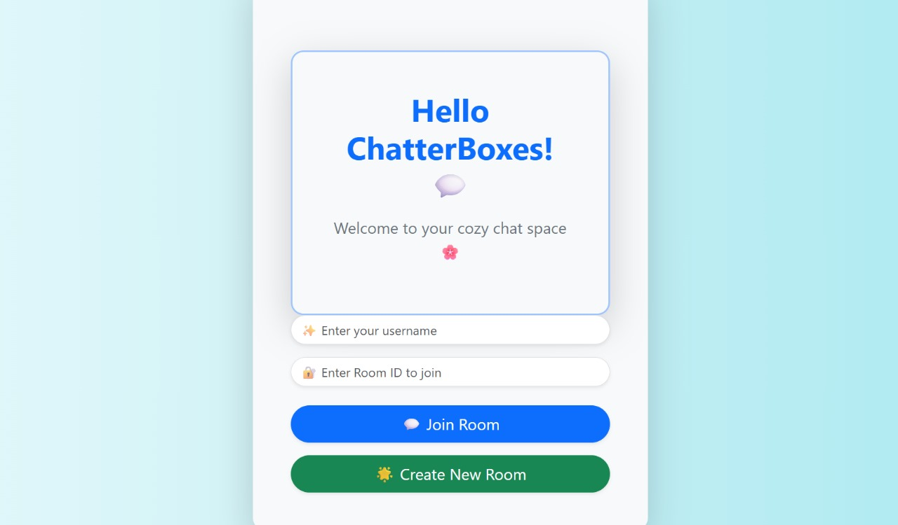

# 💬 ChatterBox

ChatterBox is a real-time chatting web application built with **Vite**, **Socket.io**, and **Node.js**. It allows multiple users to communicate instantly in public or private chatrooms.

---

## 🚀 Features

- 🔒 Real-time bi-directional communication
- 🧑‍🤝‍🧑 Multiple user chat support
- 🌐 Socket.io backend
- ⚡ Fast frontend built with Vite + React/Vue
- 📱 Responsive UI

---

## 📸 Screenshot



> 📌 Make sure the image path is correct. You can create an `assets` folder and add your screenshot as `screenshot.png`.

---

## 🛠️ Tech Stack

- Frontend: `React` (with Vite)
- Backend: `Node.js`, `Express`
- Real-time: `Socket.io`
- Styling: `Tailwind CSS` (or your stack)

---

## 🧪 How to Run Locally

```bash
# Clone the repo
git clone https://github.com/Vanshika-d25/ChatterBox.git

# Go to the client
cd client
npm install
npm run dev

# In a new terminal, go to the server
cd ../server
npm install
node index.js
