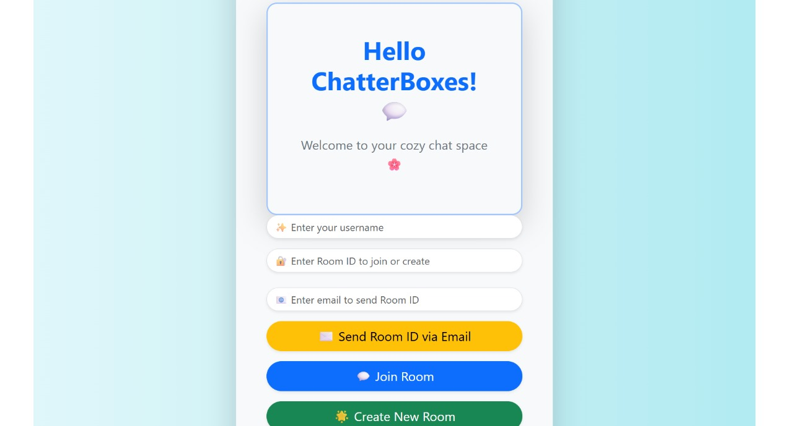
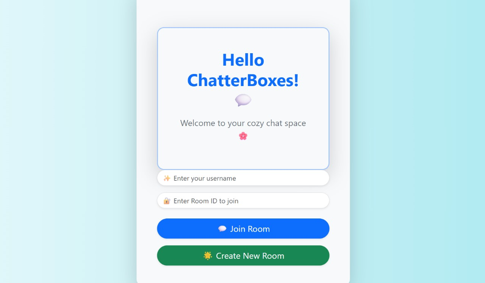
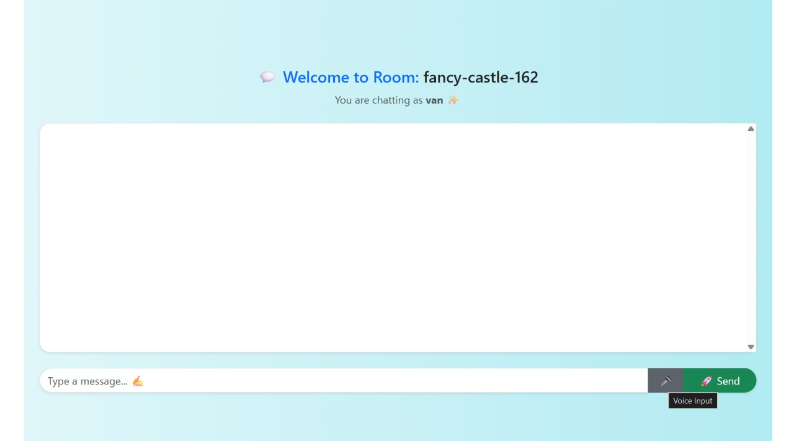

# 💬 ChatterBox — Real-Time Chat with AI & Voice Features

ChatterBox is a modern real-time chatting web application built with **Vite**, **React**, **Node.js**, and **Socket.io**.  
It supports instant messaging, room-based communication, speech-to-text AI, email invitations, and beautiful room IDs optimized for a smooth user experience.

---

## 🚀 Features

### 🔥 Core Chat Features
- ⚡ **Real-time messaging** using Socket.io  
- 🔒 **Room-based chat system** (public & private rooms)  
- 👥 **Multiple users chatting simultaneously**  
- 🌐 **No phone number required** — fully web-based  
- 💻 **Fast & lightweight UI** built using Vite + React  

---

## 🤖 AI & Enhanced Features

### 🎙️ **AI Voice-to-Text Messaging**
Speak instead of typing!  
ChatterBox converts speech → text instantly using the Web Speech API.

### 💌 **Email Room Invitations (Nodemailer)**
Users can invite others by sending the room ID directly via email.

### 🌟 **Beautiful Human-Friendly Room IDs**
Replaces ugly UUIDs with names like:
- `sunny-ocean-415`
- `magic-river-912`
- `blue-tiger-128`

Makes rooms easier to share and remember.

### 🛡️ Upcoming AI Add-ons
- Smart auto-replies  
- Chat summarizer  
- AI translation  
- Toxic message detection  

---

## 🖼️ Screenshots

### 📸 Home / Room Creation


### 💬 Chat Interface


### 🎙️ Voice Chat Feature


(Add more screenshot tags if needed)

---

## 🛠️ Tech Stack

### Frontend  
- ⚛️ React (with Vite)  
- 🎨 Bootstrap  

### Backend  
- 🟩 Node.js  
- 🚏 Express  

### Real-time  
- 🔌 Socket.io  

---

## 🧪 How to Run Locally

### 1️⃣ Clone the repository
```bash
git clone https://github.com/Vanshika-d25/ChatterBox.git
# Clone the repo
git clone https://github.com/Vanshika-d25/ChatterBox.git

# Go to the client
cd client
npm install
npm run dev

# In a new terminal, go to the server
cd ../server
npm install
node index.js
